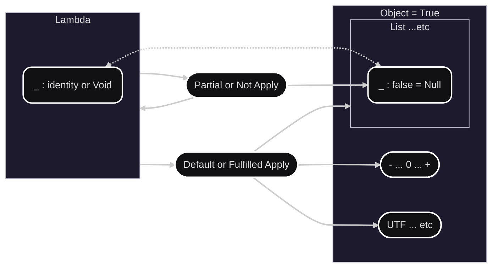
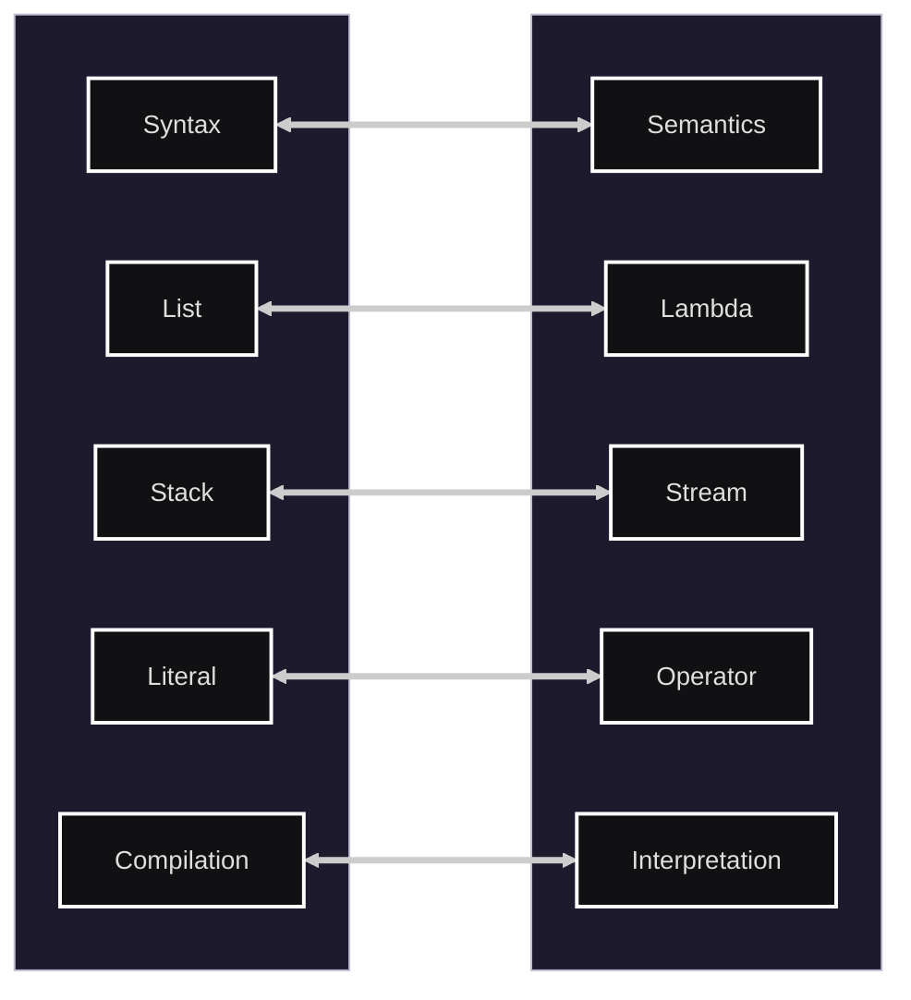

# Sign integrity generic notation


Welcome to the Sign integrity generic notation Page!

This is a language for expressing the integrity of data evaluation generic way.
It is designed to be used in various Anyone, such as data validation, integrity checks, and Functional Effects.

## Manifesto

* [Our Manifesto](./documents/manifesto/manifesto.en-us.md)
* [日本語版はこちら](./documents/manifesto/manifesto.ja-jp.md)

## Example

* [language example](./documents/en-us/example.en-us.sn)
* [日本語はこちら](./documents/ja-jp/example.ja-jp.sn)

## Reference

* [language reference](./documents/en-us/Sign_reference_en-us.md)
* [日本語はこちら](./documents/ja-jp/Sign_reference_ja-jp.md)

## Specification

* [language specification](./documents/en-us/specification/)
* [日本語はこちら](./documents/ja-jp/specification/)

## License

* [Language-License](./documents/License/sign-language-license.en-us.md)
* [日本語はこちら](./documents/License/sign-language-license.ja-jp.md)

## Concept view





## Playground

You can launch the interactive web-based playground locally using any of the following (defaults to port `3980`):

- **npm script**:
  ```bash
  npm run playground [-- <port>]
  # Example: npm run playground -- 8080
  ```
- **Shell script** (for macOS/Linux/Git Bash):
  ```bash
  ./sign_web.sh [<port>]
  # Example: ./sign_web.sh 8080
  ```
- **PowerShell script** (for Windows PowerShell):
  ```powershell
  .\sign_web.ps1 [<port>]
  # Example: .\sign_web.ps1 8080
  ```

This will start the local development server at the selected port (default `http://localhost:3980`) and automatically open your default web browser.

