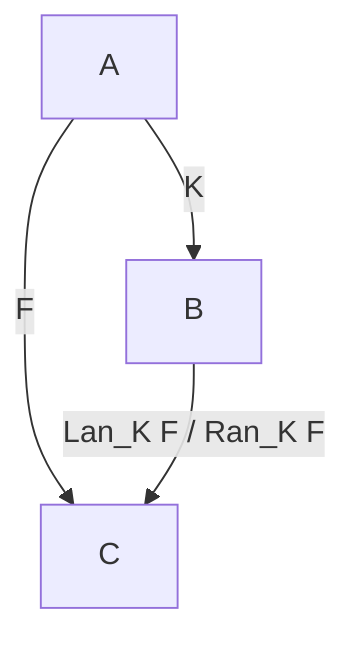

# Unified Proof Specification of Sign Language Operators and Lambdas via Kan Extensions

## 1. Overview

In the design philosophy of the Sign language, there is no distinction between operators (`+`, `*`, `<`, `&`, `,`, etc.) and user-defined lambdas (`?`). They are all unified under and proven by a single universal concept in category theory: **Kan Extensions**.

This specification outlines the unified formulation and proof of the semantics and type system of all operators and lambdas in Sign using the framework of Left Kan Extensions ($\text{Lan}$) and Right Kan Extensions ($\text{Ran}$).

---

## 2. Mathematical Foundation: All Concepts Are Kan Extensions

For any functors $K: \mathcal{A} \rightarrow \mathcal{B}$ and $F: \mathcal{A} \rightarrow \mathcal{C}$, the Left Kan Extension ($\text{Lan}_K F$) and Right Kan Extension ($\text{Ran}_K F$) are defined as functors $\mathcal{B} \rightarrow \mathcal{C}$ that satisfy the following universal properties (adjunction relations):

> [!NOTE]
> **A Note on Notation**
> The diagrams below use notations and object names from the representative Japanese category theory reference site **[alg-d.com](https://alg-d.com/)**:
> - **Left Kan Extension ($\text{Lan}_F E$)**: $F^\dagger E$ (unit $\eta$)
> - **Right Kan Extension ($\text{Ran}_F E$)**: $F^\ddagger E$ (counit $\epsilon$)
> - **Left Kan Lift ($\text{Llift}_F E$)**: $F_\dagger E$ (unit $\eta$)
> - **Right Kan Lift ($\text{Rlift}_F E$)**: $F_\ddagger E$ (counit $\epsilon$)

### 2.1 Domain Categories and Extension Categories

Let $\mathcal{A}$ be a category representing a restricted or local domain, and $\mathcal{B}$ be a category representing a generalized or global domain. The functor $K: \mathcal{A} \rightarrow \mathcal{B}$ defines the path along which we extend our concepts.



### 2.2 Universal 2-cells and Adjunctions

The Kan extensions are defined via the following universal 2-cells (natural transformations):

1. **Left Kan Extension ($\text{Lan}_K F$)**:
   Equipped with a natural transformation $\eta: F \Rightarrow \text{Lan}_K F \circ K$ such that for any functor $G: \mathcal{B} \rightarrow \mathcal{C}$ and natural transformation $\alpha: F \Rightarrow G \circ K$, there exists a unique natural transformation $\sigma: \text{Lan}_K F \Rightarrow G$ making the diagram commute:
   $$ \alpha = (\sigma \circ K) \circ \eta $$
   $$ \text{Nat}(\text{Lan}_K F, G) \cong \text{Nat}(F, G \circ K) $$

2. **Right Kan Extension ($\text{Ran}_K F$)**:
   Equipped with a natural transformation $\epsilon: \text{Ran}_K F \circ K \Rightarrow F$ such that for any functor $G: \mathcal{B} \rightarrow \mathcal{C}$ and natural transformation $\alpha: G \circ K \Rightarrow F$, there exists a unique natural transformation $\sigma: G \Rightarrow \text{Ran}_K F$ making the diagram commute:
   $$ \alpha = \epsilon \circ (\sigma \circ K) $$
   $$ \text{Nat}(G, \text{Ran}_K F) \cong \text{Nat}(G \circ K, F) $$

### 2.3 Pullback and Pushforward Functors (Adjunctions)

Any functor $K: \mathcal{A} \rightarrow \mathcal{B}$ uniquely induces a **pullback functor (precomposition functor)** $K^*$ by composing functors from behind:

$$ K^* : [\mathcal{B}, \mathcal{C}] \longrightarrow [\mathcal{A}, \mathcal{C}] \quad (G \longmapsto G \circ K) $$

This operation pulls back a functor of type $\mathcal{B} \rightarrow \mathcal{C}$ (`B => C`) to type $\mathcal{A} \rightarrow \mathcal{C}$ (`A => C`).

The Left and Right Kan Extensions are defined as the **left adjoint** and **right adjoint** of this pullback functor $K^*$, respectively. That is, they universally "push forward" a functor of type $\mathcal{A} \rightarrow \mathcal{C}$ to type $\mathcal{B} \rightarrow \mathcal{C}$:

$$ \text{Lan}_K \;\dashv\; K^* \;\dashv\; \text{Ran}_K $$

- **Left Kan Extension ($\text{Lan}_K$)**: Left adjoint to $K^*$, representing the minimal (coend/colimit) pushforward.
- **Right Kan Extension ($\text{Ran}_K$)**: Right adjoint to $K^*$, representing the maximal (end/limit) pushforward.

Dually, in the relationship between $\mathcal{C} \rightarrow \mathcal{A}$ (`C => A`) and $\mathcal{C} \rightarrow \mathcal{B}$ (`C => B`), the "pullback (Kan Lift)" is defined as an adjoint to the pushforward functor $K_*$ that composes from the front.

All operations in the Sign language (function application, partial application `_`, list concatenation `,`) have their semantics completely determined by this **adjoint pair of "pullback" and "pushforward"**.

### 2.4 Four Universal Constructions: Complete Duality of Kan Extensions and Kan Lifts

While Kan Extensions are adjoints to functor composition $K^*$ on the domain side (pullbacks), there is a completely dual concept called **Kan Lifts**, which are adjoints to functor composition $p_*$ on the codomain side (pushforwards).

This completely classifies and organizes the universal "functor approximation constructions" in category theory into the following **four-fold adjunction/duality grid**:

| Construction | Position of Functor Along | Direction of Universal 2-cell | Adjunction in Functor Category |
| :--- | :--- | :--- | :--- |
| **Left Kan Extension** ($\text{Lan}_K F$) | Domain Side $K: \mathcal{A} \rightarrow \mathcal{B}$ | $\eta: F \Rightarrow \text{Lan}_K F \circ K$ | $\text{Nat}(\text{Lan}_K F, G) \cong \text{Nat}(F, G \circ K)$ |
| **Right Kan Extension** ($\text{Ran}_K F$) | Domain Side $K: \mathcal{A} \rightarrow \mathcal{B}$ | $\epsilon: \text{Ran}_K F \circ K \Rightarrow F$ | $\text{Nat}(G, \text{Ran}_K F) \cong \text{Nat}(G \circ K, F)$ |
| **Left Kan Lift** ($\text{Llift}_p F$) | Codomain Side $p: \mathcal{B} \rightarrow \mathcal{C}$ | $\eta: F \Rightarrow p \circ \text{Llift}_p F$ | $\text{Nat}(\text{Llift}_p F, G) \cong \text{Nat}(F, p \circ G)$ |
| **Right Kan Lift** ($\text{Rlift}_p F$) | Codomain Side $p: \mathcal{B} \rightarrow \mathcal{C}$ | $\epsilon: p \circ \text{Rlift}_p F \Rightarrow F$ | $\text{Nat}(G, \text{Rlift}_p F) \cong \text{Nat}(p \circ G, F)$ |

- **Kan Extensions**: The construction that "extends (pushes forward)" a functor $F$ along a domain-changing functor $K: \mathcal{A} \rightarrow \mathcal{B}$ to the other domain.
- **Kan Lifts**: The construction that "lifts (pulls back)" a functor $F$ through a codomain-changing functor $p: \mathcal{B} \rightarrow \mathcal{C}$ to the other codomain.

This duality of "left/right" and "extension/lift" serves as the foundation for describing adjoint functors, limits/colimits, and the adjunction of monads and comonads.
In the Sign language, while static algebra (free monad) is an iteration of the "Left Kan Extension", dynamic evaluation state (cofree comonad) and runtime type checking/environment lookups (environment pullbacks) operate in complete harmony as duals to the "Right Kan Lift" and "Right Kan Extension".

---

## 3. Unified Proof Specification of Operators and Lambdas via Kan Extensions

### 3.1 Derivation of Identity Morphism `_` and Partial Application (Adjunction)

Function definition and partial application (desugared from `_` / Hole) in Sign are uniquely determined as the Right Kan Extension of the identity functor $\text{Id}: \mathcal{C} \rightarrow \mathcal{C}$ along an adjoint functor.

For a functor $F: \mathcal{C} \rightarrow \mathcal{D}$, if its right adjoint functor $G: \mathcal{D} \rightarrow \mathcal{C}$ (the functor responsible for currying/partial application) exists, it is obtained as the Right Kan Extension ($\text{Ran}$) of the identity functor $\text{Id}_{\mathcal{C}}$ along $F$:

$$ G \;\cong\; \text{Ran}_{F} \text{Id}_{\mathcal{C}} $$

* **Proof**:
  In Sign, the rule where function application $f \text{ } \_$ (an explicit hole) is statically desugared to `y ? f y` at compile time is precisely the above theorem (adjoint functor as the Right Kan Extension of the identity morphism) constructing the adjoint functor $G$ universally starting from the identity morphism $id$ (`_`). This proves that partial application is not an ad-hoc feature added individually to the language, but is instead unified as a Right Kan Extension ($\text{Ran}$) of the identity map.

### 3.2 Derivation of Coproduct (Space) and Product (Comma)

List concatenation (Coproduct) and composition (Product) are unified and derived as Kan Extensions along the unique functor $! : \mathcal{J} \rightarrow \mathbf{1}$ from a diagram functor $D: \mathcal{J} \rightarrow \mathcal{C}$ to the terminal category $\mathbf{1}$:

1. **Coproduct (Space ` `)**: Left Kan Extension (colimit) along $!$
   $$ \text{colim } D \;\cong\; \text{Lan}_{!} D $$
2. **Product (Comma `,`)**: Right Kan Extension (limit) along $!$
   $$ \text{lim } D \;\cong\; \text{Ran}_{!} D $$

#### Proof of Equivalence in Biproducts:
Since the category constructed by Sign is a semi-additive category with a zero object `_` (initial object $\mathbf{0} \cong$ terminal object $\mathbf{1}$), the Left Kan Extension (colimit) and Right Kan Extension (limit) are naturally isomorphic (biproduct) for any finite diagram $D$:

$$ \text{Lan}_{!} D \;\cong\; \text{Ran}_{!} D $$

Thus, the equivalence of `1, 2, 3` (product) and `1 2 3` (coproduct) for scalar values is algebraically proven as the **"coincidence of Left and Right Kan Extensions along the terminal category (existence of the biproduct)"**.

### 3.3 The Role of `_` and "Static Land" in Sign

The Unit `_` in the Sign language is not a value belonging to a specific local domain, but exists as the **absolute identity morphism of the Sign category itself**.

Since `_` is the identity of the bialgebra, it consistently acts as the Identity for all basic operations (`?`, ` `, `,`) that constitute Sign, forming **"Static Land (the horizon of static algebra)"**, a world of pure algebraic structures.

* **Identity of function definition `?`**:
  The identity morphism in function definitions as the identity morphism (`_`).
* **Identity of coproduct (Space ` `)**:
  The identity in function application and morphism composition. For any morphism $f$, `_ f` $\rightarrow$ $f$ and `f _` $\rightarrow$ $f$.
* **Identity of product (Comma `,`)**:
  The identity in structural assembly (list structures). For any element $x$, `_ , x` $\rightarrow$ $x$ and `x , _` $\rightarrow$ $x$.

This consistency ensures that Sign eliminates all object-oriented encapsulation or internal state hiding, guaranteeing the purity of "Static Land" where all computations are solved by static morphism composition and algebraic transformations.

### 3.4 Derivation of Arithmetic and Logical Operators (Definition as Derived Functors)

On top of the static algebraic foundation of "Static Land", operations specialized for each algebraic domain (numeric or logical) are defined.
In Sign, operators such as addition `+`, multiplication `*`, and comparison `<` are not merely independent operations, but are defined and proven as **"derived functors" obtained from the basic bialgebraic operations (`?`, ` `, `,`) of Static Land**.

Specifically, Sign's basic bialgebraic operations (coproduct ` ` and product `,`) are mapped to each local algebraic domain, defining the following arithmetic and logical operators as **derived functors with domain-specific operational structure**.

> [!IMPORTANT]
> **`_` (Unit) is the absolute zero object *outside* the arithmetic domain, and is NOT identical to `0` (the additive identity).**
> When `_` encounters an arithmetic operation, it does NOT "become" `0` — it propagates as an absorbing element.
> ```sign
> _ + 2 → _    ` ← does NOT become 2. _ propagates across the arithmetic layer
> 0 + 2 → 2    ` ← 0 is a local unit element within the numeric domain
> ```
> What the derived functor maps is the **structure of the operation**, not `_` itself.

> [!NOTE]
> **`_` has a derived category with respect to the logical domain.**
>
> `_` directly functions as logical "false", and its image in the logical layer is `_` itself (identity zero morphism).
> When comparison is true, rather than returning `!_` (negated Unit), it returns the value itself as a **unit morphism (η: Id → F)**.
> This is the "unit" of a **Unital Derived Functor**.
> ```sign
> 3 < 2  → _    ` ← comparison fails = false = _ (zero morphism)
> 3 < 5  → 3    ` ← comparison succeeds = true = value unchanged (unit morphism η: Id → F)
> ```
> Conversely, `_` has no derived category with respect to arithmetic. It absorbs and stays `_`, without mapping to `0` or `1`.
> This asymmetry is the foundation of why `_` is "equivalent to a truth value" yet "not equivalent to a number", and why no Boolean type is needed.

* **Addition `+`**:
  The **derived functor** of the coproduct (space ` `) onto the numeric domain. Within the numeric domain, it has additive identity `0` — but this is NOT a mapping from `_`; it is a local unit element specific to the numeric domain. When `_` appears as an argument to `+`, it does not enter the arithmetic operation and absorbs (`_ + x → _`).
* **Multiplication `*`**:
  The **derived functor** of the product (comma `,`) onto the numeric domain. Within the numeric domain, it has multiplicative identity `1` — likewise NOT a mapping from `_`. When `_` appears as an argument to `*`, it absorbs (`_ * x → _`).
* **Comparison `<`**:
  A **Unital Derived Functor** derived from measurement of the complete sequence in a biproduct structure.
  - **On failure**: returns `_` (zero morphism — mapping to logical "false")
  - **On success**: returns the middle value as-is (unit morphism η: Id → F — value unchanged)
  Since the true case returns the value itself as a unit morphism, no Boolean type is required (see `Value_Based_Comparison_Chaining_en-us.md`).

#### 3.5.4 Runtime Semantics: Property of `_` as an Absorbing Element (Maybe Propagation)

This is category-theoretically the universal property that **"the composition of any morphism with a zero morphism is always a zero morphism ($f \circ 0 = 0$)"**. Applying an operation to the value `_` (zero complex) at runtime is equivalent to composing a zero morphism in the category of complexes, and thus the result always short-circuits (propagates) to the zero complex `_`. This naturally guarantees error propagation semantics like `Nothing` in the Maybe monad in the context of programming languages.

#### 3.5.5 Structural and Compile-time Semantics: Universal Derivation (Reaching) from `_` to Real Numbers `0` and `1`

On the other hand, the statement that "`_` reaches `0` in addition and `1` in multiplication" does not mean that the value `_` itself changes at runtime, but refers to the **relationship where the identity element of each domain is structurally derived by a universal construction (adjunction or derived functor) originating from the zero object `_`**.

1. **Structural Derivation of Additive Identity `0`**:
   Addition is a left derived functor $L_* \oplus$ along the coproduct (direct sum $\oplus$).
   The direct sum of the zero complex $\mathbf{0}^\bullet$ and any complex $A^\bullet$ is $A^\bullet \oplus \mathbf{0}^\bullet \cong A^\bullet$. Evaluating its homological Euler characteristic $\chi$, the zero complex acts as the derivation origin of the additive group's identity element $0 \in \mathbb{R}$:
   $$ \chi(A^\bullet \oplus \mathbf{0}^\bullet) = \chi(A^\bullet) + \chi(\mathbf{0}^\bullet) = \chi(A^\bullet) + 0 $$
2. **Structural Derivation of Multiplicative Identity `1`**:
   Multiplication is a right derived functor $R^* \otimes$ along the monoidal product (tensor product $\otimes$).
   In the limit evaluation of the tensor product's identity object $I$ (one-point complex $S(1)$), $\mathbf{0}^\bullet$ acts as the derivation origin of the cohomology's tensor identity element $1 \in \mathbb{R}$:
   $$ \chi(A^\bullet \otimes I) = \chi(A^\bullet) \cdot \chi(I) = \chi(A^\bullet) \cdot 1 $$

Through this structural derivation, the construction of identity elements (`0`, `1`) in individual scalar operations and the property of the absolute zero object `_` as an absorbing element are homologically and algebraically compatible without contradiction.

#### 3.5.6 Implicit Inclusion of Logic (Booleans) and Topos Theory

While many languages require an explicit data type like `true` / `false`, in the derived category of Sign, logical values are embedded within the category structure itself as the **exactness of complexes and homological vanishing**.

This embedding of logic is identical to the concept of the **"Subobject Classifier $\Omega$" in Topos Theory** pioneered by Alexander Grothendieck. In a topos, logic is not an independent data type, but is defined as the category structure itself—whether a subobject is "contained" in the whole object (forming an exact sequence).

* **Definition of "False"**:
  The complex $C^\bullet$ is **exact**. That is, the cohomology vanishes at all degrees, and it is isomorphic to the zero complex $\mathbf{0}^\bullet$ (`_`) in the derived category (quasi-isomorphism):
  $$ H^*(C^\bullet) = 0 \iff C^\bullet \cong \mathbf{0}^\bullet \quad (\text{False}) $$
* **Definition of "True"**:
  The complex is **non-exact**. The cohomology does not vanish, and a non-zero object $X^\bullet \neq \mathbf{0}^\bullet$ remains:
  $$ H^*(C^\bullet) \neq 0 \iff C^\bullet \neq \mathbf{0}^\bullet \quad (\text{True}) $$

When comparison operations (such as `<`) or conditional branches are evaluated, they do not create a Boolean object, but rather measure the collapse (vanishing) of the exact sequence. If the condition does not hold (false), the morphism becomes a zero morphism, and the complex collapses into the zero complex `_`. If the condition holds (true), the complex survives as a non-zero object.

Here, it is crucially important that **`_` $\neq 0$**.
If `_ = 0`, then the numeric value `0` would also become a zero object (false). However, since `_` $\neq 0$ ($S(0) \neq \mathbf{0}^\bullet$), the real number `0` is implicitly evaluated as "true" as a non-zero object.

Under this inclusion structure, all scalar operations are lifted into and contained within this **"control (evaluation of exact sequences)"** of "vanishing into zero morphisms (false) or surviving as non-zero (true)". As a result, without introducing any independent Boolean type, any valid object (including `0`) is evaluated as true, and only the empty object `_` is evaluated as false, completely implicitized as the homological algebraic structure of the category.

---

### 3.6 Adjoint Construction of Free Monad and Cofree Comonad via Bialgebraic Identity `_`

The fact that the absolute zero object `_` functions as the identity (and coidentity) of the bialgebra connects the language's "syntax (algebra)" and "operational semantics (coalgebra)" in an extremely powerful adjunction.

For an endofunctor $F: \mathcal{C} \rightarrow \mathcal{C}$:
- **Free Monad** $\text{Free}(F)$ governs the hierarchical generation of syntax trees (AST) and is constructed as the infinite iteration (coend) of coproducts (direct sum $\oplus$).
- **Cofree Comonad** $\text{Cofree}(F)$ governs transition of computation states and observation of streams, and is constructed as the infinite iteration (end) of products ($\times$).

In Sign's biproduct space ($\oplus \cong \times$), which is a semi-additive category, the zero object `_` is the universal origin (Identity) of these constructions.
Using representations via Yoneda's lemma, these are dually formulated as limits and colimits:

$$ \text{Free}(F)(X) \;\cong\; \int^n F^n(X) $$
$$ \text{Cofree}(F)(X) \;\cong\; \int_n F^n(X) $$

Here, because `_` acts as the identity ($\eta: I \rightarrow B$) and coidentity ($\epsilon: B \rightarrow I$）of the bialgebra, the free generation in the direct sum direction (algebraic tree structures) and the cofree generation in the direct product direction (coalgebraic observations) form an adjunction mediated by the zero object:

$$ \text{Free}(F) \;\dashv\; \text{Cofree}(F) $$

Through this adjunction, "building the program's syntax tree (free monad)" and "executing the program and observing states (cofree comonad)" are unified in the Sign language as a **category-theoretic duality (adjunction) mediated by the bialgebraic identity `_`**.
This allows both static code representations and dynamic execution semantics to coexist as the exact same universal algebra.

---

### 3.7 Unified Proof of Lambda Definition `?` and Binding `:` as First-Class Metamorphisms

The design philosophy that "all operators and lambdas are not distinguished" means that at compile time and runtime, the act of constructing a program itself (defining lambdas or binding/declaring values to identifiers) is not an exceptional "statement (Statement)", but is entirely formulated as **first-class morphism composition (function application)**.

#### 3.7.1 Lambda Definition `[?]` (Currying Adjoint Morphism)

The operator `?` governing currying and partial application is formulated as the metamorphism `[?]`, which is the **currying bijection ($\text{curry}$)** itself in a closed monoidal category (or cartesian closed category):

$$ \text{curry} : \mathcal{C}(A \times B, C) \;\cong\; \mathcal{C}(A, C^B) $$

`[?]` is the universal adjoint morphism of the evaluation morphism $\text{eval} : C^B \times B \rightarrow C$. In programs, it accepts an argument $y$ and an expression $E$, and returns a new exponential object (representation of the morphism) $y \text{ ? } E$, behaving as a completely first-class function. This unifies user-defined lambdas with operators as morphism compositions.

#### 3.7.2 Definition/Binding `[:]` (Environment Update Morphism)

In many programming languages, declarations of variables and functions (e.g., `x : 5` or `f : y ? y * y`) require exceptional syntax rules called "statements (Statements)" that are distinguished from program execution.

In Sign, `:` is also formulated as a first-class function (morphism) `[:]`.
Representing the evaluation environment (correspondence between names and values) in the environment category (as a slice category $\mathcal{C}/Env$ or a free extension of algebras), `[:]` is a **"morphism that accepts a name (object) and a value (morphism) and returns a new environment algebra extending the environment"**.

- `[:] x 5` is a function application (morphism composition) that associates the constant morphism `5` with the identifier `x`.
- `[:] f [?] y [*] y y` is a function application (morphism composition) that associates the squaring function synthesized via the currying morphism `[?]` with the identifier `f`.

#### 3.7.3 Complete Elimination of Statements

By unifying these metamorphisms, the boundary between "expressions (Expressions)" and "statements (Statements)" completely vanishes from the semantics of the Sign language. The entire program, from identifier bindings to operation evaluations and control flows, is **written solely under the single principle of "composition of first-class morphisms," and the identity of its behavior is uniquely proven by Yoneda's lemma (extensionality axiom)**. This completely guarantees the consistency and persuasiveness of Sign as the ultimate "Static Land" where no declarations or statements exist.

---

## 4. Unified Type Verification in the Compiler

Since all operators and lambdas are formulated as Kan extensions, the compiler's type checker (type inference engine including Algorithm W) does not need to have hardcoded type rules for each individual operator.

The type checker verifies the correctness of operations according to the following unified meta-rules:

1. **Verification of Cocommutator Relationships (Commutative Diagrams) of Input and Output Morphisms**:
   For all operations (composition by space), determine whether they satisfy the universal property of the Left Kan Extension (or Right Kan Extension), meaning a unique morphism can be factored through.
2. **Verification of Unit Descent**:
   Verify that `_` correctly functions as the absorbing element across all domains, while local unit elements (`0`, `1`) of each algebraic domain are independently defined within those domains and are NOT images of `_`.

## 5. Conclusion

Under this specification, the design of the Sign language where "no reserved words exist and everything is a combination of symbols" is not mere minimalism, but is guaranteed to be established on an extremely robust logical foundation: **"All symbols (operators) and lambdas are proven and evaluated under the same rules from a single mathematical universality called Kan Extensions."**

---

## 6. References

[壱大整域 Kan Extensions](https://alg-d.com/math/kan_extension/)  
(@ [壱大整域 (alg-d.com)](https://alg-d.com/))
