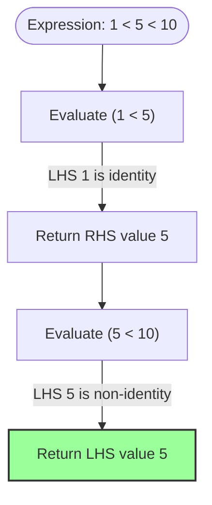
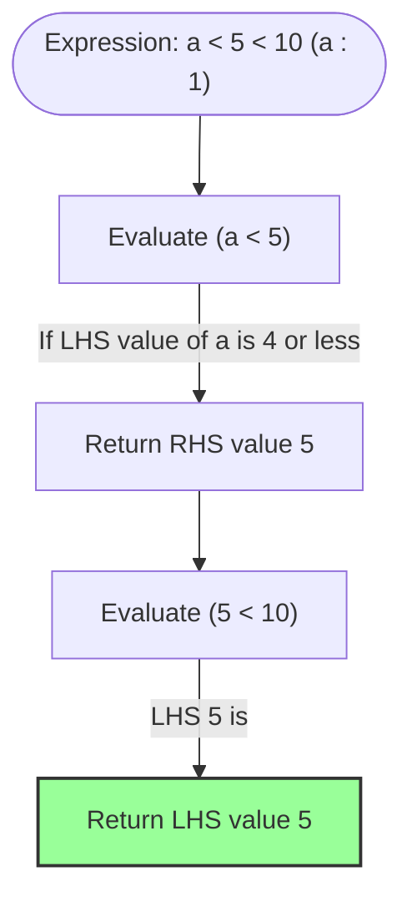

# Algebraic Specification of Comparison Operator Value Return and Chained Evaluation (Chaining)

## 1. Overview

Comparison operations (`<`, `>`, `<=`, `>=`, `=`, `!=`) in the Sign language return the value of a specific operand when the condition is true, and return `_` (Unit/Nothing) when false. This behavior is designed to express conditional filtering and monadic propagation concisely.

This specification defines rules that support both denotational semantics (identity of denotation and referential transparency) and intuitive ternary chained comparison (returning the middle term in expressions like `1 < x < 10`), by eliminating syntax-tree-based judgments (literal vs. variable) and introducing **value-based algebraic rules** ("whether the value of the left-hand side is an algebraic identity element").

---

## 2. Evaluation Rules and Algebraic Dispatch

When a comparison operator `op` (e.g., `<`) is applied to two arguments `LHS` (left-hand side) and `RHS` (right-hand side), the evaluation result $V$ is determined according to the following rules:

### 2.1 Definitional Formula

$$ V = \text{eval}(LHS \text{ op } RHS) = \begin{cases} 
\text{select}(LHS, RHS) & (\text{when the comparison condition is true}) \\
\_ & (\text{when the comparison condition is false})
\end{cases} $$

Here, the function $\text{select}(LHS, RHS)$ which selects the operand to return is defined based on the **value of the left-hand side** as follows:

$$\text{select}(LHS, RHS) = \begin{cases} 
RHS & (\text{value}(LHS) \in \{0, 1, \_\}) \\
LHS & (\text{otherwise})
\end{cases}$$

* **Identity Elements (Exception Rule)**: If the value of the LHS is either `0` (additive identity) or `1` (multiplicative identity), the **value of the right-hand side (RHS)** is returned.
* **Normal Rule**: Otherwise, the **value of the left-hand side (LHS)** is returned. (For the coproduct identity `_`, since it is not the identity of arithmetic operations, the LHS value `_` is returned.)

---

## 3. Guarantee of Denotational Semantics (Referential Transparency)

The most prominent feature of this specification is that the selection of the returned value depends on the evaluated **value itself** rather than the syntax tree representation (literal vs. variable).

### 3.1 Proof of Referential Transparency

In an environment where variable `a` is bound to `1` ($[\![ a ]\!] = 1$), we evaluate the expression $f(x) = x < 5$ $.

#### Pattern A: When the argument is the literal `1`
1. Evaluate $[\![ 1 < 5 ]\!]$. The comparison is true.
2. Since LHS $1$ is the multiplicative identity, select the RHS value $5$.
3. The result is $5$.

#### Pattern B: When the argument is the variable `a`
1. Evaluate $[\![ a < 5 ]\!]$.
2. Retrieve the evaluated value of LHS $a$, which is $[\![ a ]\!] = 1$. The comparison is true.
3. Since the evaluated value $1$ is the multiplicative identity, select the RHS value $5$.
4. The result is $5$.

This maintains the following equivalence completely, regardless of the expression used in the program:

$$ [\![ f(1) ]\!] = [\![ f(a) ]\!] = 5 $$

---

## 4. Evaluation Flow of Ternary Chained Comparison (`A < B < C`)

We show the mechanism by which the middle variable term `x` is correctly propagated during the left-associative evaluation process.

### 4.1 Example: `1 < x < 10` (when x = 5)

The expression is evaluated as `(1 < x) < 10` due to left-associativity.



### 4.2 Example: `a < x < 10` (when a : 1, x : 5)

Even when using a variable `a`, the evaluation flow remains identical.



---

## 5. Application Examples as Monadic Filters

Using value-returning comparisons and identity rules, the Sign language can write `Maybe` monad and conditional control flows (If-Then) in function synthesis without noise.

### 5.1 Conditional Addition Pipeline

Processing that adds `5` to value `x` only if `x` is positive, and propagates `_` (Unit) otherwise:

```sign
` x > 0 returns x (LHS) if true, and returns _ if false
result : [x > 0] + 5
```

* **When $x = 10$**:
  1. `10 > 0` $\rightarrow$ LHS is $10$ (non-identity) $\rightarrow$ returns $10$.
  2. `10 + 5` $\rightarrow$ returns $15$.
* **When $x = -3$**:
  1. `-3 > 0` $\rightarrow$ false $\rightarrow$ returns `_`.
  2. `_ + 5` $\rightarrow$ returns `_` (propagation of Unit).

### 5.2 Bound Range Checking via Logical AND (Intersection)

```sign
` Get x if x is greater than 1 and less than 10
valid_x : [1 < x] & [x < 10]
```

1. `1 < x` $\rightarrow$ LHS is $1$ (identity) $\rightarrow$ returns $x$ if true.
2. `&` operator $\rightarrow$ evaluates RHS if LHS is true (non-Unit).
3. `x < 10` $\rightarrow$ LHS is $x$ (non-identity) $\rightarrow$ returns $x$ if true.
4. As a result, it returns $x$ if the condition is met, and `_` otherwise, sharing the exact same denotation as the ternary notation (`1 < x < 10`).
