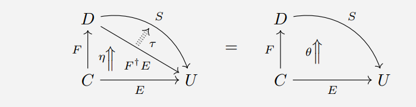
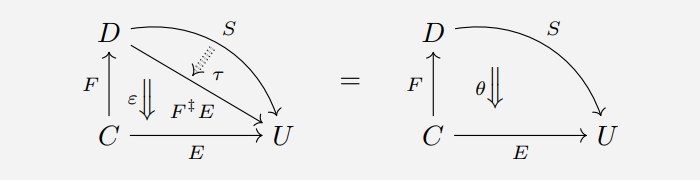
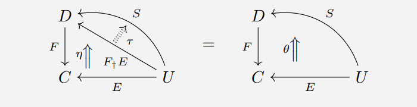
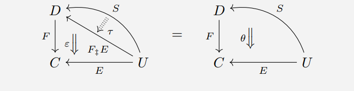

# Kan拡張によるSign言語の演算子とラムダの統一的対応検証仕様

## 1. 概要

Sign言語の設計において、演算子（`+`, `*`, `<`, `&`, `,` 等）とユーザー定義のラムダ（`?`）は区別されません。実装の試行錯誤を積み重ねる中で、これらすべての挙動が、圏論における **Kan拡張（Kan Extension）** という単一の普遍的な概念と**構造的に対応していること**が帰納的に確認されました。

本仕様書は、左Kan拡張（Left Kan Extension: $\text{Lan}$）と右Kan拡張（Right Kan Extension: $\text{Ran}$）の枠組みを用いて、Signの演算子およびラムダのセマンティクスが Kan拡張の構造といかに整合するかを記述・検証するものです。

> [!NOTE]
> **開発の方向性について**
>
> 本文書に記述される Kan 拡張との対応は、Sign 言語の設計の**出発点**ではありません。
> 実装の積み重ねの中で、Sign の演算子の挙動が Kan 拡張の構造と収束・一致することが**帰納的に確認された**ものです。
> 以下の記述における「証明」は「Kan 拡張を前提として Sign を演繹した」ことを意味するのではなく、
> **「Sign の観察された挙動が Kan 拡張の定義と整合することの確認」** を意味します。

---

## 2. 数学的基盤：すべての概念はKan拡張である

任意の関手 $K: \mathcal{A} \rightarrow \mathcal{B}$ と $F: \mathcal{A} \rightarrow \mathcal{C}$ に対し、左Kan拡張（Left Kan Extension: $\text{Lan}_K F$）と右Kan拡張（Right Kan Extension: $\text{Ran}_K F$）は、以下の普遍性（随伴関係）を満たす関手 $\mathcal{B} \rightarrow \mathcal{C}$ として定義されます。

> [!NOTE]
> **図式内の記法について**
> 以下の図式は、国内の代表的な圏論解説サイトである **[alg-d.com](https://alg-d.com/)** の資料から引用・抜粋しています。そのため、図式内では以下の記法（随伴の普遍記号および対象名）が使用されています。
> - **左Kan拡張 ($\text{Lan}_F E$)**: $F^\dagger E$ （単位 $\eta$）
> - **右Kan拡張 ($\text{Ran}_F E$)**: $F^\ddagger E$ （余単位 $\epsilon$）
> - **左Kanリフト ($\text{Llift}_F E$)**: $F_\dagger E$ （単位 $\eta$）
> - **右Kanリフト ($\text{Rlift}_F E$)**: $F_\ddagger E$ （余単位 $\epsilon$）
>
> （ここで $F$ は沿わせる関手（ドメイン/コドメイン変更）、$E$ は拡張/リフト対象の関手、$S$ は任意の比較対象関手、$\tau$ は普遍性から一意に定まる自然変換を示します）

### 2.1 Kan拡張

#### 2.1.1 左Kan拡張 ($\text{Lan}_K F$)

左Kan拡張は、関手 $F$ を $K$ に沿って「余極限方向（colimit方向）」に拡張したものです。任意の関手 $G: \mathcal{B} \rightarrow \mathcal{C}$ に対して、以下の自然同型（随伴関係）が成立します。

$$ \text{Nat}(\text{Lan}_K F, G) \;\cong\; \text{Nat}(F, G \circ K) $$

これは、自然変換 $\eta: F \Rightarrow \text{Lan}_K F \circ K$ （単位）が存在し、任意の自然変換 $\alpha: F \Rightarrow G \circ K$ に対して、一意な自然変換 $\sigma: \text{Lan}_K F \Rightarrow G$ が存在して $\alpha = (\sigma * K) \circ \eta$ を満たすことを意味します。

#### 2.1.2 右Kan拡張 ($\text{Ran}_K F$)

右Kan拡張は、関手 $F$ を $K$ に沿って「極限方向（limit方向）」に拡張したものです。任意の関手 $G: \mathcal{B} \rightarrow \mathcal{C}$ に対して、以下の自然同型（随伴関係）が成立します。

$$ \text{Nat}(G, \text{Ran}_K F) \;\cong\; \text{Nat}(G \circ K, F) $$

これは、自然変換 $\epsilon: \text{Ran}_K F \circ K \Rightarrow F$ （余単位）が存在し、任意の自然変換 $\alpha: G \circ K \Rightarrow F$ に対して、一意な自然変換 $\sigma: G \Rightarrow \text{Ran}_K F$ が存在して $\alpha = \epsilon \circ (\sigma * K)$ を満たすことを意味します。

### 2.2 Kan Lift

終域側を変更する関手 $p: \mathcal{B} \rightarrow \mathcal{C}$ に対して、関手 $F: \mathcal{A} \rightarrow \mathcal{C}$ を因子分解するように「持ち上げる（引き戻す）」構成をKanリフト（Kan Lift）と呼びます。

#### 2.2.1 左Kanリフト ($\text{Llift}_p F$)

左Kanリフトは、自然変換 $\eta: F \Rightarrow p \circ \text{Llift}_p F$ を伴う普遍構成です。

#### 2.2.2 右Kanリフト ($\text{Rlift}_p F$)

右Kanリフトは、自然変換 $\epsilon: p \circ \text{Rlift}_p F \Rightarrow F$ を伴う普遍構成です。

### 2.3 関手の「引き戻し（Pullback）」と「押し出し（Pushforward）」の双対性

Kan拡張の数学的本質は、関手圏における**引き戻し（Pullback）**と**押し出し（Pushforward）**の随伴関係にあります。

任意の関手 $K: \mathcal{A} \rightarrow \mathcal{B}$ は、関手を後ろから合成する**引き戻し関手（Precomposition / Pullback Functor）** $K^*$ を一意に誘導します。

$$ K^* : [\mathcal{B}, \mathcal{C}] \longrightarrow [\mathcal{A}, \mathcal{C}] \quad (G \longmapsto G \circ K) $$

これは、$\mathcal{B} \rightarrow \mathcal{C}$（`B => C`）型の関手を、$\mathcal{A} \rightarrow \mathcal{C}$（`A => C`）型へと「引き戻す」操作です。

この引き戻し関手 $K^*$ に対し、その**左随伴**および**右随伴**として定義されるのがKan拡張です。すなわち、$\mathcal{A} \rightarrow \mathcal{C}$ 型の関手を $\mathcal{B} \rightarrow \mathcal{C}$ 型へと普遍的に「押し出す」操作に対応します。

$$ \text{Lan}_K \;\dashv\; K^* \;\dashv\; \text{Ran}_K $$

- **左Kan拡張 ($\text{Lan}_K$)**: $K^*$ の左随伴であり、最小（コエンド/余極限）の押し出し。
- **右Kan拡張 ($\text{Ran}_K$)**: $K^*$ の右随伴であり、最大（エンド/極限）の押し出し。

双対的に、$\mathcal{C} \rightarrow \mathcal{A}$（`C => A`）と $\mathcal{C} \rightarrow \mathcal{B}$（`C => B`）の関係においては、前から合成する押し出し $K_*$ に対する随伴として「引き戻し（Kan Lift）」が定義されます。

Sign言語におけるあらゆる演算（関数適用、部分適用 `_`、リスト連接 `,`）は、この**「引き戻し（Pullback）」と「押し出し（Pushforward）」の随伴対**によってセマンティクスが完全に決定されます。

### 2.4 4組の普遍構成：Kan拡張とKanリフトの完全な双対性

Kan拡張はドメイン（始域）側での関手合成 $K^*$ （引き戻し）に対する随伴ですが、これと完全に双対をなす概念として、コドメイン（終域）側での関手合成 $p_*$ （押し出し）に対する随伴である**Kanリフト（Kan Lift）**が存在します。

これにより、圏論における普遍的な「関手の近似構成」は、以下の**4組の随伴・双対グリッド**として完全に分類され、整理されます。

| 構成名 | 沿う関手の位置 | 普遍2-cell（自然変換）の向き | 関手圏における随伴関係 |
| :--- | :--- | :--- | :--- |
| **左Kan拡張** ($\text{Lan}_K F$) | 始域側 $K: \mathcal{A} \rightarrow \mathcal{B}$ | $\eta: F \Rightarrow \text{Lan}_K F \circ K$ | $\text{Nat}(\text{Lan}_K F, G) \cong \text{Nat}(F, G \circ K)$ |
| **右Kan拡張** ($\text{Ran}_K F$) | 始域側 $K: \mathcal{A} \rightarrow \mathcal{B}$ | $\epsilon: \text{Ran}_K F \circ K \Rightarrow F$ | $\text{Nat}(G, \text{Ran}_K F) \cong \text{Nat}(G \circ K, F)$ |
| **左Kanリフト** ($\text{Llift}_p F$) | 終域側 $p: \mathcal{B} \rightarrow \mathcal{C}$ | $\eta: F \Rightarrow p \circ \text{Llift}_p F$ | $\text{Nat}(\text{Llift}_p F, G) \cong \text{Nat}(F, p \circ G)$ |
| **右Kanリフト** ($\text{Rlift}_p F$) | 終域側 $p: \mathcal{B} \rightarrow \mathcal{C}$ | $\epsilon: p \circ \text{Rlift}_p F \Rightarrow F$ | $\text{Nat}(G, \text{Rlift}_p F) \cong \text{Nat}(p \circ G, F)$ |

- **Kan拡張 (Extensions)**: ドメインを変更する $K: \mathcal{A} \rightarrow \mathcal{B}$ に沿って、関手 $F$ を他方のドメインへと「拡張（押し出し）」する構成。
- **Kanリフト (Lifts)**: コドメインを変更する $p: \mathcal{B} \rightarrow \mathcal{C}$ を通して、関手 $F$ を他方のコドメインへと「持ち上げ（引き戻し）」する構成。

この「左右」および「拡張・リフト」が織りなす4組の双対性は、随伴関手や極限・余極限、そしてモナドとコモナドの随伴を記述する基盤となります。
Sign言語においては、静的な代数（自由モナド）が「左Kan拡張」の反復であるのに対し、動的な評価状態（余自由コモナド）や実行時の型チェック・束縛環境の検索（環境の引き戻し）が「右Kanリフト」や「右Kan拡張」の双対として完全に調和して動作します。

---

## 3. 演算子とラムダのKan拡張による統一的証明仕様

### 3.1 恒等射 `__` と部分適用（随伴）の導出

Signの関数定義および部分適用（`_` / Holeによる脱糖）は、恒等関手 $\text{Id}: \mathcal{C} \rightarrow \mathcal{C}$ の随伴関手に沿った右Kan拡張として一意に決定されます。

関手 $F: \mathcal{C} \rightarrow \mathcal{D}$ に対し、その右随伴関手 $G: \mathcal{D} \rightarrow \mathcal{C}$（カリー化/部分適用を司る関手）が存在するとき、これは恒等関手 $\text{Id}_{\mathcal{C}}$ の $F$ に沿った右Kan拡張（$\text{Ran}$）として得られます。

$$ G \;\cong\; \text{Ran}_{F} \text{Id}_{\mathcal{C}} $$

* **証明**:
  Signにおいて、関数適用 $f \text{ } \_$ （明示的な穴）がコンパイル時に静的脱糖（`y ? f y`）される規則は、恒等射 $id$（`__`）から出発して随伴関手 $G$ を普遍的に構成する上の定理（恒等射の右Kan拡張としての随伴関手）そのものです。これにより、部分適用という機能が言語に個別に追加されたアドホックなものではなく、恒等写像の右Kan拡張（$\text{Ran}$）として統一的に証明されます。

### 3.2 余積（スペース）と直積（カンマ）の導出

リストの連接（Coproduct）と組み合わせ（Product）は、ダイアグラム関手 $D: \mathcal{J} \rightarrow \mathcal{C}$ からターミナル圏 $\mathbf{1}$ への一意な関手 $! : \mathcal{J} \rightarrow \mathbf{1}$ に沿ったKan拡張として統一的に導出されます。

1. **余積（スペース ` `）**: $!$ に沿った左Kan拡張（余極限）
   $$ \text{colim } D \;\cong\; \text{Lan}_{!} D $$
2. **直積（カンマ `,`）**: $!$ に沿った右Kan拡張（極限）
   $$ \text{lim } D \;\cong\; \text{Ran}_{!} D $$

#### スカラー型における双積的等価性の観察:
スカラー型において `1, 2, 3`（直積）と `1 2 3`（余積）が等価になるという挙動が実装上確認されています。この観察は、左Kan拡張（余極限）と右Kan拡張（極限）の一致——すなわち**双積（Biproduct）の存在**——と構造的に対応しています。

$$ \text{Lan}_{!} D \;\cong\; \text{Ran}_{!} D $$

> [!NOTE]
> この等価性は「Sign の圏全体が半加法圏（Semi-additive Category）である」という主張ではありません。
> スカラードメインにおいて観察された挙動が双積の性質と整合しているという記述です。
> Sign の圏が半加法圏の公理を完全に満たすかどうかは、より精緻な検証が必要な未解決の問題です。

### 3.3 Signにおける「Static Land（静的代数の地平）」と `__` (Unit) の役割

Sign言語における `__`（Unit）は、特定のローカルなドメインに属する値ではなく、**Signの圏自身が持つ絶対的な単位元**として存在します。

`__` は双代数（Bialgebra）の単位元であるため、Signを構成するすべての基本演算（`?`, ` `, `,`）に対して一貫して**代数的単位元**として作用し、  
純粋な代数構造の世界である **「Static Land（静的代数の地平）」** を形成します。

* **関数定義 `?` の単位元**:
  単位元（`__`）としての関数定義における恒等元。
* **余積（スペース ` `）の代数的単位元**:
  リスト連接（余積）における単位元。空リストとしての `__` に対し、`__ f` $\rightarrow$ $f$、`f __` $\rightarrow$ $f$（リスト連接の単位元法則）。
* **直積（カンマ `,`）の単位元**:
  構造的組み立て（リスト構造）における単位元。任意の要素 $x$ に対し、`__ , x` $\rightarrow$ $x$、`x , __` $\rightarrow$ $x$。

この一貫性により、Signはオブジェクト指向的なカプセル化や内部状態の隠蔽を一切排除し、  
すべての計算が静的な射の合成と代数の変形によって解かれる「Static Land」としての純粋性を保証します。

> [!IMPORTANT]
> **`__`（単位元）と `[__ ]` / `[ __]`（恒等射）の明確な区別**
>
> `__` は**単位元（Unit 値）**であって、厳密な圏論的意味での**恒等射（Identity Morphism）そのもの**ではありません。
> Sign における真の恒等射は、ブラケット記法によって構成されます：
>
> - **`[__ ]`** : 左から引数を受け取る恒等射。静的脱糖により `$p0 ? __ $p0` → `$p0 ? $p0` と等価。
> - **`[ __]`** : 右から引数を受け取る恒等射。静的脱糖により `$p0 ? $p0 __` → `$p0 ? $p0` と等価。
>
> `__` 単体は、関数適用においてアリティの状態に応じた振る舞い（未飽和なら吸収、飽和なら評価駆動）を示します。
> `[__ ]` / `[ __]` は、既存のブラケット・Hole 構文から自然に導出される真の恒等関数です。
> この区別は、Haskell における `mempty`（モノイド単位元）と `id`（恒等関数）の区別に相当します。

### 3.4 算術演算子と論理演算子の導出（導来関手としての定義）

「Static Land」の静的代数基盤の上に、各代数ドメイン（数値や論理）に特化した演算が定義されます。  
Signにおいて、加法 `+`、乗算 `*`、比較演算 `<` などの演算子は、単に独立した演算ではなく、  
**Static Landの基本双代数演算（`?`, ` `, `,`）から得られる「導来関手（Derived Functor）」**として定義され、証明されます。

具体的には、一般圏の絶対的零対象 `__` から、各局所代数ドメインへの普遍的な解像度（Resolution）および極限・余極限の射影を通じて、  
以下の算術・論理演算の**ドメイン固有の単位元**が構造的に導出されます。

* **加法 `+`**:
  余積（スペース ` `）の数値ドメインへの**左導来関手（Left Derived Functor）**。絶対的零対象 `__` から左随伴/余極限の構造的導出プロセスを経て定義される加法単位元 `0` を持つ。
* **乗算 `*`**:
  直積（カンマ `,`）の数値ドメインへの**右導来関手（Right Derived Functor）**。絶対的零対象 `__` から右随伴/極限（テンソル積）の構造的導出プロセスを経て定義される乗法単位元 `1` を持つ。
* **比較演算 `<`**:
  双積構造における完全系列の測定から導かれる導来関手。対象を絶対的零対象 `__`（偽）および単位元 `0`, `1`（真の境界）へとマッピングする半加法圏の射。真の時に $id$ 射（`0`, `1` の時は右辺、それ以外は左辺）を返す挙動は、双積空間における射の分解として一意に証明されます（`Value_Based_Comparison_Chaining_ja-jp.md` 参照）。

### 3.5 導来圏における `__` の役割と外延的同一性の証明

Signの構築する圏が導来圏（Derived Category） $\mathcal{D}(\mathcal{C})$ であるということは、絶対的零対象 `__` が実数の `0` や `1` とは明確に異なる（`__` $\neq 0$）こと、それにも関わらず演算を通じていかにしてそれらへ到達するのか、およびなぜ論理値（Boolean型）を完全に暗黙化（排除）できるのかを示す強力な根拠となります。

#### 3.5.1 `__` $\neq 0$ および `__` $\neq 1$ の絶対的区別

導来圏 $\mathcal{D}(\mathcal{C})$ において、すべての値および式 $X$ は複体 $X^\bullet$ として表現されます。

* **絶対的零対象 `__`**:
  すべての次数において零対象 $\mathbf{0}$ である**零複体 $\mathbf{0}^\bullet$** に対応します。これは圏全体の自明な単位元です。
* **スカラー値 `0` および `1`**:
  これらは、次数 $0$ にのみそれぞれ実数（または整数）の $0$ または $1$ を持ち、他の次数は零対象 $\mathbf{0}$ である**非零な一点複体 $S(0)$ および $S(1)$** に対応します。

したがって、代数的・圏論的に以下の非等価性が絶対的に成立します。

* `__` $\neq 0 \quad (\mathbf{0}^\bullet \neq S(0))$
* `__` $\neq 1 \quad (\mathbf{0}^\bullet \neq S(1))$

この区別は、乗算において `__ * 5` が `0 * 5 = 0` へと崩壊することを防ぎ（乗法単位元として機能させるため）、またBooleanの暗黙化において「数値 `0` は存在する対象なので真である」という一貫性を維持するために不可欠です。

#### 3.5.2 グロタンディークの「相対的観点」と関数の外延性公理による同一性証明

素朴集合論のように、値を静的な集合の元（例えばフォン・ノイマンによる $0 = \emptyset$）として定義すると、外延性公理（要素の等価性）によって `__`（空集合 $\emptyset$）と `0` が同一視されてしまい、PLセマンティクスが崩壊します。

この問題に対し、Signはアレクサンドル・グロタンディークの**「相対的観点（Relative Point of View）」**を採用します。すなわち、すべてのオブジェクト（値・演算子・制御）を孤立した点として見るのではなく、他の対象（または制御）に作用する、あるいは作用される**「射（Morphism / 関数）」**として相対的にモデル化します。

この前提のもと、値の同一性（等価性）は **関数の外延性公理（Function Extensionality）** に基づいて外延的に決定されます。

$$ A = B \iff \forall x (A \text{ op } x = B \text{ op } x) $$

値（射）としての `__` と `0` は、演算（制御）に対する作用（外延）において明確に異なります。

- **加法 `+` に対する外延の不一致**:
  任意の非零対象 $x \neq \_\_$ に対し、以下が成り立ちます。
  `__ + x = __` であるのに対し、`0 + x = x`。
- **乗法 `*` に対する外延の不一致**:
  任意の $x \neq \_\_$ に対し、以下が成り立ちます。
  `__ * x = __` であるのに対し、`0 * x = 0`。

このように、演算に遭遇した際の振る舞い（適用結果）が異なるため、関数の外延性公理によって **`__` $\neq 0$** が数学的に一意に証明されます。

#### 3.5.3 米田の補題による外延性公理の圏論的証明

前節で導入した関数の外延性公理による同一性判定は、圏論における最重要の定理の一つである**米田の補題（Yoneda Lemma）**によって完全に裏付けられます。

米田埋め込み $y: \mathcal{C} \rightarrow [\mathcal{C}^{\text{op}}, \mathbf{Set}]$ により、すべての対象（値） $A$ は、他のすべての対象からの射を測定する表象関手（Representable Functor） $y(A) = \mathcal{C}(-, A)$ として関手圏に埋め込まれます。米田の補題は、この埋め込みがフルかつ忠実（Full and Faithful）であることを保証します。

$$ \text{Nat}(\mathcal{C}(-, A), \mathcal{C}(-, B)) \;\cong\; \mathcal{C}(A, B) $$

これにより、対象 $A$ と $B$ が同一である（あるいは射 $A \rightarrow B$ が同型である）ことは、任意の対象 $X$ に対する射（演算）の振る舞い（自然変換）が一致することと同値となります。

Signにおいて、`__` と `0` は静的な要素ではなく、他のスカラー値や演算に対する「射」として機能します。米田の補題が示す通り、両者が同一の対象であるためには、すべての演算の文脈において全く同じ自然変換（振る舞い）を示さなければなりませんが、前述の通り加法や乗法に対して異なる外延（`__ + x = __` と `0 + x = x` などの異なる射）を返すため、米田埋め込みの射影において両者は明確に異なる対象として区別されます。

$$ y(\_\_) \;\neq\; y(0) \implies \_\_ \;\neq\; 0 $$

このように、「外延的な挙動の違いによって同一性を決定する」という言語仕様は、米田の補題の直接的な帰結として証明されます。

#### 3.5.4 実行時セマンティクス：すべての演算に対する吸収元（零射伝播）

実行時のプログラム評価において、`__` は任意の演算 $f$ に対して**吸収元（Absorbing element / 零元）**として機能します。

$$ f(x, \_\_) = \_\_ \quad \text{および} \quad f(\_\_, x) = \_\_ $$

具体的には、スカラー加法 `__ + 5 = __`、乗法 `__ * 5 = __` など、すべての演算は `__` がオペランドに含まれると、評価結果を `__` に潰します。 

これは圏論的に **「任意の射と零射（Zero Morphism）の合成は常に零射となる（$f \circ 0 = 0$）」** という普遍的な性質そのものです。実行時に値としての `__`（零複体）に演算を適用することは、複体の圏において零射を合成することと同値であり、したがって結果は常に零複体 `__` にショートサーキット（伝播）します。これはプログラミング言語の文脈における Maybe モナドの `Nothing` のようなエラー伝播セマンティクスを自然に保証します。

#### 3.5.5 構造的・コンパイル時セマンティクス：`__` から実数 `0`, `1` への普遍的導出（到達）

一方、「`_` が加法において `0` に、乗法において `1` に到達する」とは、実行時に値 `_` 自体が変化するという意味ではなく、**零対象 `_` を起点とした普遍的構成（随伴や導来関手）によって、各ドメインの単位元が構造的に導出される関係**を指します。

1. **加法単位元 `0` への構造的到達**:
   加法は余積（直和 $\oplus$）に沿った左導来関手 $L_* \oplus$ です。
   零複体 $\mathbf{0}^\bullet$ と任意の複体 $A^\bullet$ の直和は $A^\bullet \oplus \mathbf{0}^\bullet \cong A^\bullet$ となり、そのホモロジー的オイラー標数 $\chi$ を評価すると、零複体は加法群の単位元 $0 \in \mathbb{R}$ の導出起点として作用します。
   $$ \chi(A^\bullet \oplus \mathbf{0}^\bullet) = \chi(A^\bullet) + \chi(\mathbf{0}^\bullet) = \chi(A^\bullet) + 0 $$
2. **乗法単位元 `1` への構造的到達**:
   乗法はモノイダル積（テンソル積 $\otimes$）に沿った右導来関手 $R^* \otimes$ です。
   テンソル積の単位対象 $I$（一点複体 $S(1)$）に対する極限評価において、$\mathbf{0}^\bullet$ はコホモロジーのテンソル単位元 $1 \in \mathbb{R}$ の導出起点として作用します。
   $$ \chi(A^\bullet \otimes I) = \chi(A^\bullet) \cdot \chi(I) = \chi(A^\bullet) \cdot 1 $$

この構造的導出により、個別スカラー演算における単位元（`0`, `1`）の構成と、絶対的零対象 `__` の吸収元としての性質が、ホモロジー代数的に無矛盾に両立します。

#### 3.5.6 トポス論と論理（Boolean）の暗黙的包含

多くの言語は `true` / `false` という明示的なデータ型を必要としますが、Signの導来圏においては、論理値は**複体の完全性（Exactness）とコホモロジーの消滅（Homological Vanishing）**として圏構造そのものに内包されます。

この論理の埋め込みは、グロタンディークが創始した **トポス論（Topos Theory）における「サブオブジェクト分類子（Subobject Classifier） $\Omega$」** の思想と同一です。トポスにおいて、論理は独立したデータ型ではなく、部分対象が全体対象の中に「包含されるか（完全系列となるか）」という圏の構造そのものとして定義されます。

* **「偽（False）」の定義**:
  複体 $C^\bullet$ が **完全（Exact）** であること。すなわち、すべての次数でコホモロジーが消滅し、擬同型において零複体 $\mathbf{0}^\bullet$ （`__`）と同型になること。
  $$ H^*(C^\bullet) = 0 \iff C^\bullet \cong \mathbf{0}^\bullet \quad (\text{偽}) $$
* **「真（True）」の定義**:
  複体が **非完全（Non-exact）** であること。コホモロジーが消滅せず、非零対象 $X^\bullet \neq \mathbf{0}^\bullet$ が残存すること。
  $$ H^*(C^\bullet) \neq 0 \iff C^\bullet \neq \mathbf{0}^\bullet \quad (\text{真}) $$

比較演算（`<` など）や条件分岐が評価される際、それはBooleanオブジェクトを作るのではなく、完全系列（Exact Sequence）の崩壊（消滅）を測定します。条件が成立しない（偽）場合、射は零射となり複体は零複体 `__` に潰れます。条件が成立する（真）場合、複体は非零対象として残存します。

ここで **`__` $\neq 0$** であることが決定的に重要です。
もし `__ = 0` であるならば、数値の `0` も零対象（偽）となってしまいます。しかし `__` $\neq 0$ （$S(0) \neq \mathbf{0}^\bullet$）であるため、実数 `0` は非零対象として暗黙的に「真」と評価されます。

この包含構造により、スカラー演算（演算）はすべて、この「零射への消滅（偽）か、非零としての残存（真）か」という **「制御（完全系列の評価）」** の中に持ち上げられ、包含されます。結果として、独立したBoolean型を一切導入することなく、任意の有効なオブジェクト（`0` を含む）が真、空の対象 `__` のみが偽として、圏のホモロジー代数的構造として完全に暗黙化されます。

---

### 3.6 双代数単位元 `__` ―― 自由構成と余自由構成を媒介する共通の基底点

自己関手 $F: \mathcal{C} \rightarrow \mathcal{C}$ に対し、自由モナド $\text{Free}(F)$ と余自由コモナド $\text{Cofree}(F)$ は、それぞれ**独立した随伴**によって特徴づけられます。

$$\text{Free}(F) \;\dashv\; U_{\text{Alg}}, \qquad U_{\text{Coalg}} \;\dashv\; \text{Cofree}(F)$$

ここで $U_{\text{Alg}}: \text{Alg}(F) \rightarrow \mathcal{C}$、$U_{\text{Coalg}}: \text{Coalg}(F) \rightarrow \mathcal{C}$ はそれぞれの忘却関手です。

> [!IMPORTANT]
> $\text{Free}(F)$ と $\text{Cofree}(F)$ **自体が互いに随伴であるわけではありません**。それぞれ別の忘却関手の（左／右）随伴として独立に存在します。

Sign言語において観察される構造的事実は、この2つの独立した構成において、**`__` が共通の基底点（base case）として現れる**ということです。

- **自由モナド側**：単位 $\eta: \text{Id}_{\mathcal{C}} \Rightarrow U_{\text{Alg}} \circ \text{Free}(F)$ において、構文木の構築における「最も浅い（空の）生成」が `__` に対応する。これは**帰納的構成における基底ケース**です。

- **余自由コモナド側**：余単位 $\epsilon: U_{\text{Coalg}} \circ \text{Cofree}(F) \Rightarrow \text{Id}_{\mathcal{C}}$ において、ストリーム観測の「最も浅い（停止した）展開」が `__` に対応する。これは**余帰納的構成における基底ケース**です。

$$ \text{Free}(F)(X) \;\cong\; \int^n F^n(X) $$
$$ \text{Cofree}(F)(X) \;\cong\; \int_n F^n(X) $$

Signで観察されているのは「$\text{Free}(F)$ と $\text{Cofree}(F)$ が随伴である」という（成立しない）主張ではなく、**「構文木の生成（帰納）とストリームの展開（余帰納）という、本来別々の2つの普遍構成が、同じ `__` を基底点として共有している」**という、より弱いが**正確に成立する構造的事実**です。

この観察により、Sign言語においては「プログラムの構文木を構築すること（自由モナド）」と「そのプログラムを実行しストリームとして観測すること（余自由コモナド）」が、`__` という単一の基底点を通じて整合的に共存します。

---

### 3.7 第一級のメタ射としてのラムダ定義 `?` と定義 `:` の統一的証明

「すべての演算子とラムダは区別されない」という設計思想は、コンパイル時や実行時において、プログラムを構築する行為（ラムダの定義や、識別子への値の束縛・宣言）自体も、例外的な「文（Statement）」ではなく、すべて**第一級の射の合成（関数適用）として定式化されること**を意味します。

#### 3.7.1 ラムダ定義 `[?]` （カリー化随伴射）

カリー化および部分適用を司る `?` は、閉モノイダル圏（またはデカルト閉圏）における**随伴写像（$\text{curry}$）そのもの**であるメタ射 `[?]` として定式化されます。

$$ \text{curry} : \mathcal{C}(A \times B, C) \;\cong\; \mathcal{C}(A, C^B) $$

`[?]` は、評価射 $\text{eval} : C^B \times B \rightarrow C$ の普遍随伴射であり、プログラム上は引数 $y$ と式 $E$ を受け取り、新たな指数対象（射の表現） $y \text{ ? } E$ を生成して返す射として完全に第一級の関数として扱われます。これにより、ユーザー定義のラムダも個別ドメインの演算と同等の射の合成として決定されます。

#### 3.7.2 定義・束縛 `[:]` （環境更新射）

多くのプログラミング言語では、変数や関数の定義（`x : 5` や `f : y ? y * y` など）はプログラムの実行とは区別される「宣言文（Statement）」という構文の例外ルールを必要とします。

Signにおいて、`:` もまた第一級の関数（射） `[:]` として定式化されます。
評価環境（名前と値の対応関係）を、環境圏における表現（スライス圏 $\mathcal{C}/Env$、または代数の自由拡張）とすると、`[:]` は **「名前（対象）と値（射）を受け取り、環境を拡張した新たな環境代数を返す射」** です。

- `[:] x 5` は、識別子 `x` に対し定数射 `5` を対応付ける関数適用（射の合成）である。
- `[:] f [?] y [*] y y` は、識別子 `f` に対しカリー化射 `[?]` を介して合成された二乗関数を対応付ける関数適用（射の合成）である。

#### 3.7.3 宣言文（Statement）の完全な排除

このメタ射の統一により、Sign言語のセマンティクスから「式（Expression）」と「文（Statement）」の境界線が完全に消失します。プログラム全体は、識別子の束縛から演算の評価、さらには制御の伝播に至るまで、**「第一級の射の合成」という唯一の原理によって記述され、米田の補題（外延性公理）によってその動作の同一性が一意に証明されます**。これにより、「あらゆる宣言文すら存在しない究極の Static Land」としての整合性と説得力が完全に保証されます。

---

## 4. コンパイラにおける統一的型証明（Type Verification）

すべての演算子とラムダがKan拡張として定式化されるため、コンパイラの型チェッカー（Algorithm W を含む型推論器）は、個別の演算子ごとにハードコードされた型規則を持つ必要がなくなります。

型チェッカーは以下の統一的なメタ規則に従って、演算の正当性を検証します。

1. **入力射と出力射のココミュータ関係（可換図式）の検証**:
   すべての演算（スペースによる合成）に対し、それが左Kan拡張の普遍性（または右Kan拡張の普遍性）を満たしているか（一意な射が引受可能か）を判定する。
2. **零対象の降下（Descent）検証**:
   一般圏の $id$ 射（絶対的零対象）である `__` が、各代数ドメインに適用された際に、そのドメインの零対象（吸収元 `__`）へと正しくショートサーキット（伝播）することを検証する。

## 5. 結論

本仕様により、Sign言語における「予約語が存在せず、すべてが記号の組み合わせである」という設計は、単なるミニマリズムではなく、  
**「すべての記号（演算子）とラムダの挙動が、Kan拡張という単一の数学的普遍性と整合していることが確認された」** という観察によって裏付けられます。

この一致は、Kan 拡張を設計の出発点として演繹的に導出されたものではなく、実装の積み重ねの中で**帰納的に発見された構造的対応**です。設計の試行錯誤の末に数学的な普遍概念との収束が現れたという事実こそが、Sign 言語の設計の強度を示す最も誠実な証拠と言えます。

---

## 6. 参考文献

[壱大整域 Kan拡張](https://alg-d.com/math/kan_extension/)  
(@ [壱大整域](https://alg-d.com/))
