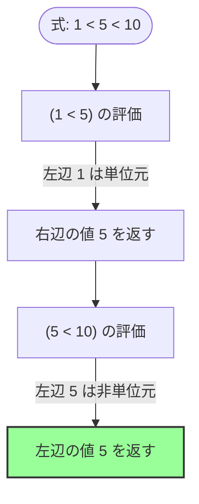
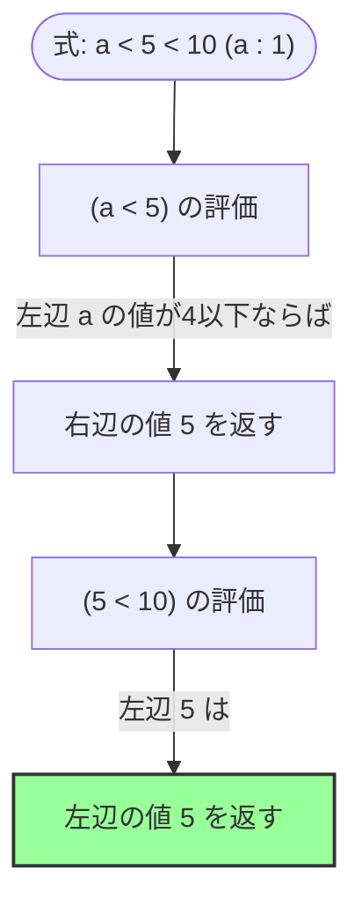

# 比較演算子の値返却と連鎖評価（Chaining）における代数的仕様

## 1. 概要

Sign言語における比較演算（`<`, `>`, `<=`, `>=`, `=`, `!=`）は、条件が真のときに特定のオペランドの値を返し、偽のときに `_`（Unit/Nothing）を返します。この挙動は、条件フィルタリングやモナド的伝播を簡潔に表現するためのものです。

本仕様書では、従来の構文カテゴリ（リテラルか変数か）に基づく判定を排し、**「左辺の値が代数的単位元であるか否か」**という値ベースの代数的ルールを導入することで、指示的意味論（指示の同一性および参照透明性）と直感的な三項連鎖比較（`1 < x < 10` 等で中央の項を返す挙動）を両立させる仕様を定義します。

---

## 2. 評価規則と代数的ディスパッチ

比較演算子 `op`（例: `<`）を二つの引数 `LHS`（左辺）と `RHS`（右辺）に適用した際、評価結果 $V$ は以下の規則に従って決定されます。

### 2.1 定義式

$$ V = \text{eval}(LHS \text{ op } RHS) = \begin{cases} 
\text{select}(LHS, RHS) & (\text{比較条件が真の場合}) \\
\_ & (\text{比較条件が偽の場合})
\end{cases} $$

ここで、返すオペランドを選択する関数 $\text{select}(LHS, RHS)$ は、**左辺の「値」**に基づき以下のように定義されます。

$$\text{select}(LHS, RHS) = \begin{cases} 
RHS & (\text{value}(LHS) \in \{0, 1, \_\}) \\
LHS & (\text{上記以外})
\end{cases}$$

* **単位元（例外ルール）**: 左辺の値が `0`（加法単位元）、`1`（乗算単位元）のいずれかである場合、**右辺（RHS）の値**を返します。
* **通常ルール**: それ以外の場合、**左辺（LHS）の値**を返します。（余積単位元 `_` の場合は、算術演算の単位元ではないため、左辺の値を返します。）

---

## 3. 指示的意味論（参照透明性）の保証

本仕様の最大の特徴は、返却値の選択が構文木（リテラルか変数か）ではなく、評価された**「値そのもの」**に依存する点にあります。

### 3.1 参照透明性の証明

変数 `a` が `1` に束縛されている環境（$[\![ a ]\!] = 1$）において、式 $f(x) = x < 5$ を評価します。

#### パターンA: 引数がリテラル `1` の場合
1. $[\![ 1 < 5 ]\!]$ を評価。比較は真。
2. 左辺 $1$ は乗算単位元であるため、右辺の値 $5$ を選択。
3. 結果は $5$ となる。

#### パターンB: 引数が変数 `a` の場合
1. $[\![ a < 5 ]\!]$ を評価。
2. 左辺 $a$ の評価値 $[\![ a ]\!] = 1$ を取得。比較は真。
3. 評価値 $1$ は乗算単位元であるため、右辺の値 $5$ を選択。
4. 結果は $5$ となる。

これにより、プログラム内の表現に関わらず以下の等価性が完全に維持されます。

$$ [\![ f(1) ]\!] = [\![ f(a) ]\!] = 5 $$

---

## 4. 三項連鎖比較（`A < B < C`）の評価フロー

左結合での評価プロセスにおいて、中央の変数項 `x` が正しく伝播するメカニズムを示します。

### 4.1 例: `1 < x < 10` (x = 5 の場合)

式は左結合により `(1 < x) < 10` として評価されます。



### 4.2 例: `a < x < 10` (a : 1, x : 5 の場合)

変数 `a` を介した場合でも、評価フローは同一になります。



---

## 5. モナド的フィルターとしての応用例

値返却型比較と単位元ルールにより、Sign言語は `Maybe` モナドや条件付き制御フロー（If-Then）を関数合成の中でノイズなく記述できます。

### 5.1 条件付き加算パイプライン

値 `x` が正の数の場合のみ `5` を足し、そうでない場合は `_`（Unit）を伝播させる処理：

```sign
` x > 0 は真なら x (LHS) を返し、偽なら _ を返す
result : [x > 0] + 5
```

* **$x = 10$ の場合**:
  1. `10 > 0` $\rightarrow$ LHSは $10$（非単位元） $\rightarrow$ $10$ を返す。
  2. `10 + 5` $\rightarrow$ $15$ を返す。
* **$x = -3$ の場合**:
  1. `-3 > 0` $\rightarrow$ 偽 $\rightarrow$ `_` を返す。
  2. `_ + 5` $\rightarrow$ `_` を返す（Unitの伝播）。

### 5.2 境界値を含む論理積（AND）による結合範囲チェック

```sign
` x が 1 より大きく、かつ 10 より小さい場合に x を得る
valid_x : [1 < x] & [x < 10]
```

1. `1 < x` $\rightarrow$ LHSは $1$（単位元） $\rightarrow$ 真なら $x$ を返す。
2. `&` 演算子 $\rightarrow$ 左辺が真（非Unit）なら右辺を評価。
3. `x < 10` $\rightarrow$ LHSは $x$（非単位元） $\rightarrow$ 真なら $x$ を返す。
4. 結果として、条件を満たせば $x$、満たさなければ `_` となり、三項表記（`1 < x < 10`）と完全に同一の指示を持ちます。
